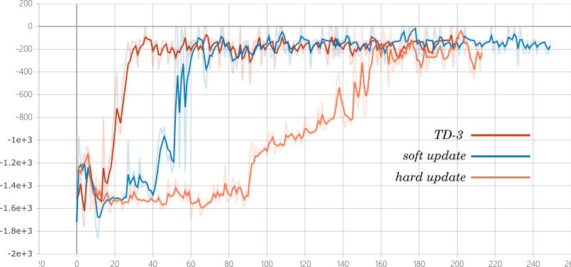

# REINFORCE-DDPG

the implement of REINFORCE algorithm and DDPG algorithm in pytorch

(update the implement in tensorflow v1)

all code is in one file and easily to follow

## requirment

- tensorboardX (for logging, you can delete the logging code if you don't need)
- pytorch (>= 1.0, 1.0.1 used in my experiment)
- gym

## REINFORCE

only in CartPole-v0 environment, can not learn well in Pendulum-v0

## DDPG

only in Pendulum-v0 for ddpg only suit for continuous task

## Compare soft-update and target network update

in pendulum-v0

`TD-3` version with 2 critic networks and soft update, `soft update` version is the one in ddpg original paper, `hard update` version is the one with the same target network update with DQN which is every C time hard update.

