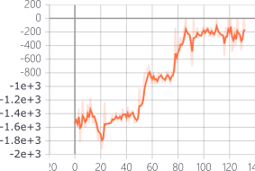
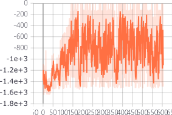
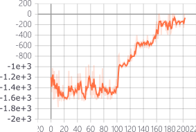

# REINFORCE-DDPG
the implement of REINFORCE algorithm and DDPG algorithm in pytorch

all code is in one file and easily to follow

## requirment

- tensorboardX (for logging, you can delete the logging code if you don't need)
- pytorch (>= 1.0, 1.0.1 used in my experiment)
- gym

## REINFORCE

only in CartPole-v0 environment, can not learn well in Pendulum-v0

## DDPG

in Pendulum-v0

## Compare soft-update and target network update
in pendulum-v0

soft update | target network(update every 4 steps) | 2 critic networks (introduced in [paper](https://arxiv.org/abs/1802.09477))
:-:|:-:|:-:
| | 

the improvement of 2 critic networks is not clear in pendulum-v0, but it's believed that would significantly speed up training on harder tasks.

