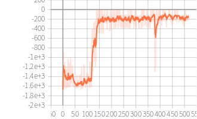

# REINFORCE-DDPG
the implement of REINFORCE algorithm and DDPG algorithm in pytorch

all code is in one file and easily to follow

## requirment

- tensorboardX (for logging, you can delete the logging code if you don't need)
- pytorch (>= 1.0, 1.0.1 used in my experiment)
- gym

## REINFORCE

only in CartPole-v0 environment, can not learn well in Pendulum-v0

## DDPG

in Pendulum-v0

